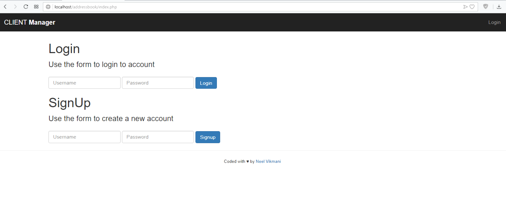
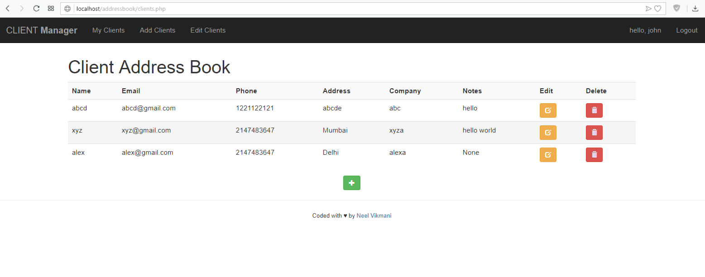
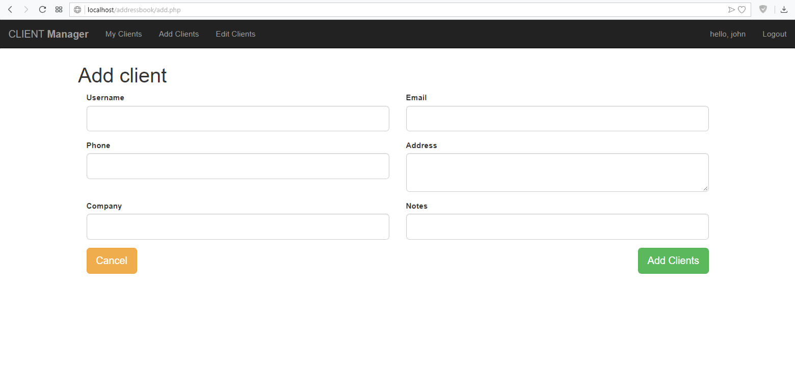
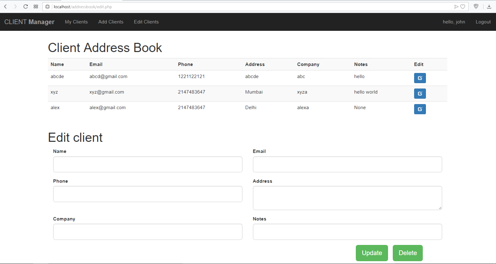
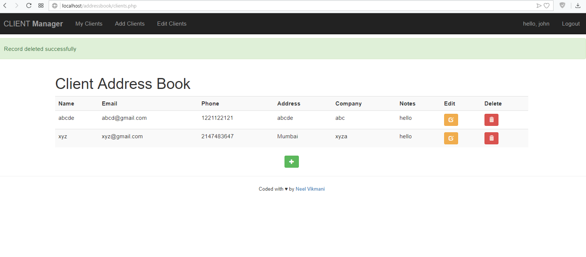

# Client-addressbook-
This is a PHP Web Application where you can register and create  records of clients, add new clients, update exising or delete them.
 
Steps-
1. Download the files of this repository and copy it inside your htdocs folder(xampp).
2. Create database named 'addressbook'. The db folder contains the sql file which you need to import in the database that you created. 
3. Start the apache and MySQL services on xampp and go to http://localhost/addressbook.

First register yourself by creating a new account and then login.
 <h2>Screenshots</h2>
<h2>Client record</h2>

<h2>Adding new clients</h2>

<h2>Updating client details</h2>

<h2>Deleting clients</h2>

